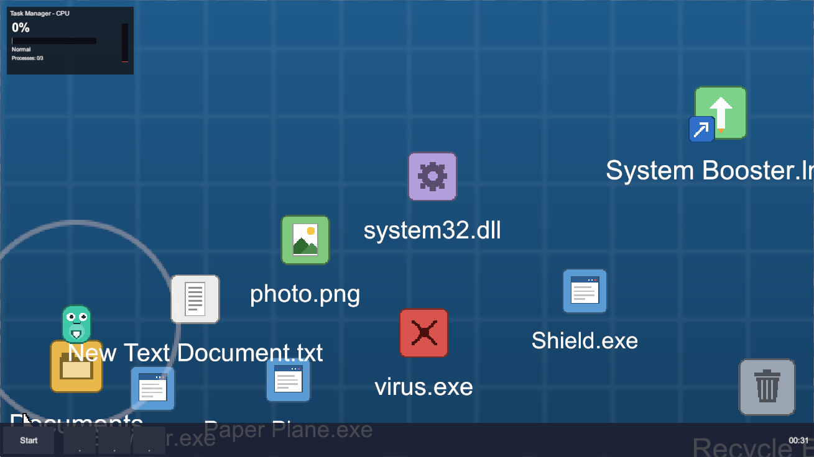

# CPU 100%

> 你的电脑中毒了。你是杀毒软件桌宠——在 CPU 飙到 100% 蓝屏之前，跳过桌面图标，装上 System Booster 拯救这台电脑。

一款 GMTK Jam 的 2D 平台跳跃游戏：**整个游戏世界就是一张电脑桌面**，所有平台都是桌面图标（文件夹、txt、病毒文件、快捷方式……），没有一块普通砖头。



## 玩法

- 杀毒软件小人在桌面图标之间跳跃，目标是碰到右上角的 **System Booster.lnk**（胜利）
- **CPU 占用率**持续上涨：启动软件、踩病毒、跌落、碰崩坏区都会加速它——到 100% 就蓝屏（失败）
- 屏幕四周的**雪花崩坏区**随 CPU 升高向 Booster 方向收缩，被吞掉的图标永久损坏（仍可踩踏，无法拾取）
- 桌面上散落着**软件图标**，用鼠标拖到角色身边即可安装进任务栏（3 个槽位）：
  - **Browser.exe** — 在光标处生成临时网页快捷方式平台（5 秒）
  - **Paper Plane.exe** — 空中冲刺
  - **Shield.exe** — 护盾，把你从崩坏区弹回安全地带
- 软件运行会持续吃 CPU；点 × 可**永久删除**换取 CPU 缓解——删了就再也没有了
- CPU 越高干扰越强：输入卡顿、左右反转、画面抖动

## 操作

| 输入 | 功能 |
|---|---|
| A / D | 左右移动 |
| Space | 跳跃 |
| 鼠标 | 虚拟光标（只能在角色附近活动） |
| 左键拖拽 | 拖动软件图标到身边安装 |
| 单击任务栏软件 | 选中 |
| 双击任务栏软件 | 启动 |
| E | 使用当前运行软件的能力 |
| 点 × | 永久删除软件 |

## 运行项目

1. Unity **6000.2.13f1**（2D URP + New Input System，无任何外部付费插件）
2. 打开 `Assets/CPU100/Scenes/CPU100_Prototype.unity`，直接进 Play Mode（建议 Game 视图 16:9）
3. 场景可随时用菜单 **Tools → CPU 100 → Build Prototype Scene** 一键重建/修复（幂等，可重复执行）

## 项目结构

```
Assets/CPU100/
├── Scenes/            CPU100_Prototype.unity
├── Scripts/
│   ├── Core/          CPU 系统、游戏胜负状态
│   ├── Player/        平台跳跃控制、地面检测、输入干扰
│   ├── Desktop/       桌面图标平台、虚拟光标、崩坏区域
│   ├── Software/      软件数据(SO)、任务栏库存、能力执行
│   ├── UI/            任务栏、CPU 窗口、蓝屏/胜利界面
│   ├── Art/           程序生成占位图工厂
│   └── Editor/        一键场景生成器
├── ScriptableObjects/ 三个软件配置资产
└── Art/               美术素材目录（见 ART_ASSETS.md，当前为程序占位图）
```

设计文档见 `buildPlan.txt`，模块接口规范见 `Docs/API_CONTRACT.md`。

## 当前状态

- ✅ 完整可玩的框架原型（移动/安装/技能/CPU/崩坏/胜负全流程）
- 🎨 全部视觉为程序生成占位图，正式美术替换中（清单：`Assets/CPU100/Art/ART_ASSETS.md`）
